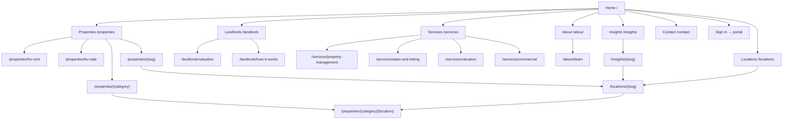

# Sunland Web Platform: Site Architecture

Status: proposed, 2026-08-18. Consumes doc 01. Feeds docs 04, 06, 07.

## 1. Current state assessment

The live site is WordPress with Elementor and a directory plugin. What it gets right: real inventory (39 listings across four categories), real locations, a real team, real testimonials, and a clear HQ address. What it gets wrong, structurally:

| Issue | Evidence | Consequence |
|---|---|---|
| Content lives at query-parameter URLs | `/?directory_type=apartment` | Category pages cannot rank or be linked cleanly |
| Deep, plugin-shaped listing paths | `/directory/apartment/{slug}` | Nested vendor namespace with no user or SEO value |
| A shopping cart on a real estate site | "Your Cart / No products in the cart" | WooCommerce loaded for nothing; confuses crawlers and users |
| Dead legal links | Terms and Privacy both point at `#` | Trust and compliance gap |
| Placeholder prices rendered as text | `KShKShKShKSh` on live listings | Reads as broken; actively costs enquiries |
| Empty review widgets | "0.0 (0)" on every card | Advertises the absence of social proof |
| Blog is thin and mostly uncategorised | Categories include "Fitness Zone", "Restaurant", "Uncategorized" | No topical authority; category taxonomy is noise |
| Landlord proposition is absent | Nav has no management or valuation entry | The highest-value audience has no path |
| Duplicate navigation blocks | Nav renders twice in markup | Crawl noise, ambiguous primary nav |
| No portal entry point | Nothing links to the ERP | Existing tenants and landlords have nowhere to go |

The nav itself is close to right: Home, About with Services, Properties, Our Team, Contact, Blog. The restructure below keeps that spine and adds the two things it is missing, a landlord path and a portal door.

## 2. Site type and depth

Small business with a catalogue. Three levels, no deeper:

- **L0** home
- **L1** primary sections: properties, services, landlords, about, insights, contact
- **L2** detail and facets: a listing, a service, a location, a post
- **L3** used only for `/properties/{type}/{location}` facet pages, and only where inventory justifies one

Every page a prospect needs is within three clicks of home.

## 3. Page hierarchy

```
Home (/)
├── Properties (/properties)
│   ├── For rent (/properties/for-rent)
│   ├── For sale (/properties/for-sale)
│   ├── Apartments (/properties/apartments)
│   ├── Villas (/properties/villas)
│   ├── Commercial (/properties/commercial)
│   ├── Land (/properties/land)
│   ├── [Facet] (/properties/{type}/{location})        e.g. /properties/apartments/kilimani
│   └── [Listing] (/properties/{slug})                  e.g. /properties/3-bedroom-duplex-lavington
├── Locations (/locations)
│   └── [Location] (/locations/{slug})                  e.g. /locations/kilimani
├── Landlords (/landlords)                              the management proposition
│   ├── Request a valuation (/landlords/valuation)
│   └── How management works (/landlords/how-it-works)
├── Services (/services)
│   ├── Property management (/services/property-management)
│   ├── Sales and letting (/services/sales-and-letting)
│   ├── Valuation (/services/valuation)
│   └── Commercial and industrial (/services/commercial)
├── About (/about)
│   └── Our team (/about/team)
├── Insights (/insights)
│   └── [Post] (/insights/{slug})
├── Contact (/contact)
├── Sign in (→ portal)
└── Legal
    ├── Privacy (/privacy)
    ├── Terms (/terms)
    └── Sitemap (/sitemap)
```

### 3.1 Why "Landlords" is its own L1

The single largest structural change. Today a property owner landing on the site sees a tenant-facing catalogue and nothing addressed to them, despite being the audience that produces mandates, which produce recurring management fees. Giving them a top-level entry with its own valuation call to action turns the site into a feeder for phase 1 of the property lifecycle.

### 3.2 Why "Locations" is separate from property facets

Two different jobs. `/properties/apartments/kilimani` answers "show me stock". `/locations/kilimani` answers "what is Kilimani like, and what does it cost", which is the query type that earns organic traffic and AI citations. The location page links down into the facet; the facet links up to the location page.

## 4. Navigation

### 4.1 Primary header

Six items, in priority order, with the portal door on the right:

```
[Sunland logo]   Properties   Landlords   Services   About   Insights   Contact      [Sign in]  [List your property]
```

Rules:
- `Properties` opens a mega panel: the six category and status links on the left, three featured listings on the right.
- `Landlords` is a direct link, no dropdown. It is a pitch, not a menu.
- `List your property` is the primary action, Sunland Yellow, rightmost.
- `Sign in` is a quiet secondary link, always present, because returning tenants and landlords must not hunt for it.
- Mobile: logo, a call button, and a drawer. `List your property` is pinned inside the drawer at the top, not buried at the bottom.

### 4.2 Footer

Four columns plus a base bar:

| Discover | Properties | For owners | Contact |
|---|---|---|---|
| About | For rent | Property management | HQ address |
| Our team | For sale | Request a valuation | Phone |
| Insights | Apartments | How management works | Email |
| Contact | Villas | Landlord portal | WhatsApp |
| Sitemap | Commercial | Tenant portal | Socials |
|  | Land |  |  |

Base bar: copyright, Privacy, Terms. Both must resolve to real pages, which they do not today.

### 4.3 Breadcrumbs

On every page below L1, mirroring the URL exactly:

```
Home > Properties > Apartments > 3 Bedroom Duplex, Lavington
Home > Locations > Kilimani
Home > Insights > What Nairobi landlords get wrong about service charge
```

Marked up as `BreadcrumbList` per doc 06.

## 5. URL structure

Rules: lowercase, hyphens, no trailing slash, no dates, no IDs, no query parameters for canonical content.

| Page type | Pattern | Example |
|---|---|---|
| Home | `/` | `/` |
| Listing index | `/properties` | `/properties` |
| Listing status facet | `/properties/{status}` | `/properties/for-rent` |
| Listing category facet | `/properties/{category}` | `/properties/apartments` |
| Category + location facet | `/properties/{category}/{location}` | `/properties/apartments/kilimani` |
| Listing detail | `/properties/{slug}` | `/properties/3-bedroom-duplex-lavington` |
| Location hub | `/locations` | `/locations` |
| Location detail | `/locations/{slug}` | `/locations/kilimani` |
| Landlord hub | `/landlords` | `/landlords` |
| Service detail | `/services/{slug}` | `/services/property-management` |
| Insight post | `/insights/{slug}` | `/insights/service-charge-explained` |
| Team | `/about/team` | `/about/team` |
| Legal | `/{slug}` | `/privacy` |

### 5.1 The slug collision problem, and the rule that solves it

`/properties/{slug}` and `/properties/{category}` occupy the same segment. A listing slugged `apartments` would shadow the category page. The rule:

1. Category, status, and location segments are a **reserved word list** held in code (`RESERVED_LISTING_SEGMENTS`).
2. Listing slug generation rejects and suffixes any slug colliding with a reserved word.
3. The route resolver checks the reserved list first, then falls through to a listing lookup.

Documented as a decision in doc 09, ADR W3, because the alternative (`/properties/listing/{slug}`) adds a dead segment to the most important URL on the site.

### 5.2 Filter parameters

Filters beyond the facet pages use query parameters and are **not** canonical: `?beds=3&min=80000&max=150000&sort=newest`. These pages self-canonicalise to the parent facet and carry `noindex, follow` when more than one filter is active. Facet pages listed in §5 are real, indexable, statically generated pages. This split is deliberate: index the pages people search for, and keep the long tail of filter combinations out of the index.

### 5.3 Facet page eligibility

A `/properties/{category}/{location}` page is generated only when it holds **three or more live listings**. Below that it is a thin page that dilutes crawl budget and disappoints the visitor. Eligibility is computed at build and revalidation time; ineligible combinations 301 to the category facet.

## 6. Internal linking

Rules that make the graph work rather than a list of links for their own sake:

1. **Every listing links to its location hub** and to its category facet. This is the main crawl path into the long tail.
2. **Every location hub links to its top three listings** and to the category facets that have stock there.
3. **Every insight post links to at least one location or service page** relevant to its subject. Posts that link nowhere are orphan content.
4. **The landlord hub links to the valuation form from three places**: hero, mid-page proof section, and closing band. It is the one page where repetition is the point.
5. **The home page links to all six L1 sections** plus the top four location hubs, so the crawler reaches depth two from the root in a single hop.
6. **No page is an orphan.** The sitemap page at `/sitemap` is the safety net, linked from the footer.

### 6.1 Anchor text

Descriptive, never "click here", never bare "read more" as the only link. A card's whole surface is clickable, but the accessible name comes from the listing title, not the word "Details" as it does today.

## 7. Redirect map from WordPress

Every legacy URL needs a 301. The rules, in evaluation order:

| Legacy pattern | Destination | Type |
|---|---|---|
| `/directory/{category}/{slug}` | `/properties/{slug}` | 301, per-listing map |
| `/?directory_type=apartment` | `/properties/apartments` | 301 |
| `/?directory_type=villa` | `/properties/villas` | 301 |
| `/?directory_type=commercial` | `/properties/commercial` | 301 |
| `/?directory_type=land-for-sale` | `/properties/land` | 301 |
| `/?directory_type=general` | `/properties` | 301 |
| `/properties/` | `/properties` | 301 |
| `/our-services/` | `/services` | 301 |
| `/our-team/` | `/about/team` | 301 |
| `/about/` | `/about` | 301 |
| `/contact/` | `/contact` | 301 |
| `/blog/` | `/insights` | 301 |
| `/blog/{slug}` | `/insights/{slug}` if migrated, else `/insights` | 301 |
| `/category/{slug}` | `/insights` | 301 |
| `/{yyyy}/{mm}/` | `/insights` | 301 |
| `/cart`, `/checkout`, `/my-account` | `/` | 301, WooCommerce residue |
| `/wp-admin`, `/wp-login.php` | `/` | 301 |
| Anything else under `/wp-content/*` | 410 after asset migration | Gone |

Implementation: a static map in `next.config.ts` for the fixed paths, plus a database-backed `web_redirects` table checked in middleware for the per-listing map, so the client can add redirects from the Content Studio without a deploy. Doc 07 §6 specifies the table.

**Per-listing map must be generated before cutover** by crawling the live site's listing URLs and pairing each with its new slug. This is a launch blocker, not a follow-up.

## 8. Sitemap and robots

- `sitemap.xml` as a Next.js route, split into `sitemap-pages.xml`, `sitemap-properties.xml`, `sitemap-locations.xml`, `sitemap-insights.xml` via a sitemap index, since listing volume will grow.
- `lastmod` derives from the publication record's `updatedAt`, not the build time. A build-time timestamp on every URL is a lie that search engines learn to ignore.
- Facet pages appear in the sitemap only when eligible per §5.3.
- `robots.txt` per doc 06 §8, allowing AI crawlers and disallowing filter parameter crawling.

## 9. Mermaid sitemap



## 10. Page inventory and priority

| Page | Wave | Template | Indexable | Business priority |
|---|---|---|---|---|
| Home | W2 | `home` | Yes | Critical |
| Listing detail | W1 | `listing` | Yes | Critical |
| Listing index | W1 | `listing-index` | Yes | Critical |
| Landlord hub | W2 | `pitch` | Yes | Critical |
| Valuation request | W4 | `form` | Yes | Critical |
| Category facets (6) | W1 | `listing-index` | Yes | High |
| Location hubs | W6 | `location` | Yes | High |
| Services hub and 4 details | W2 | `service` | Yes | High |
| Contact | W2 | `contact` | Yes | High |
| About | W2 | `editorial` | Yes | Medium |
| Team | W2 | `team` | Yes | Medium |
| Insights index and posts | W6 | `blog` | Yes | Medium |
| Category + location facets | W6 | `listing-index` | Conditional §5.3 | Medium |
| Privacy, Terms | W5 | `legal` | Yes | Required for launch |
| Sitemap page | W5 | `sitemap` | Yes | Low |
| 404, 500 | W0 | `error` | No | Required |
